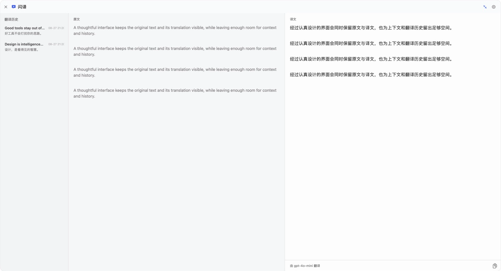
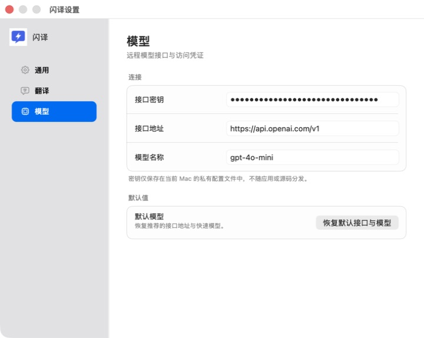

<div align="center">
  
  <h1>Transnap · 闪译</h1>
  <p>选中，唤起，翻译。一个轻量、原生、可自定义的 macOS 大模型翻译工具。</p>
  <p>
    
    
    
  </p>
</div>

Transnap 是一个原生 macOS 菜单栏应用。在任意应用中选中文字，按下自定义快捷键，译文就会出现在选区附近。它通过 `URLSession`（macOS 原生网络请求接口）直连你配置的模型服务，不启动本地服务器，也不接管系统触控板手势。

## 功能截图

<p align="center">
  
</p>

<table>
  <tr>
    <td width="56%"></td>
    <td width="44%"></td>
  </tr>
  <tr>
    <td align="center">长文本、双栏对照与翻译历史</td>
    <td align="center">自定义兼容接口、模型与本地密钥</td>
  </tr>
</table>

## 特性

- **原生体验**：使用 AppKit（macOS 原生界面框架）构建，常驻菜单栏，轻量启动。
- **就近显示**：浮层跟随选区所在屏幕，自动选择上方或下方，并支持多显示器。
- **长短文本自适应**：短文本使用紧凑浮层；长文本自动展开为双栏大窗口。
- **语境消歧**：翻译单词等短选区时，自动参考同一文本控件附近的前后文。
- **翻译历史**：最多保留 200 条本地记录，支持原文与译文对照查看。
- **自由配置模型**：支持 OpenAI-compatible API（兼容 OpenAI 聊天补全格式的接口）。
- **流式输出**：使用 SSE（服务器发送事件，一种持续返回模型输出的方式）边生成边显示。
- **可编辑提示词**：支持自定义翻译指令，并通过 `{target_language}` 插入目标语言。
- **可录制快捷键**：不强占系统词典或触控板重按，可避开截图等已有快捷键。
- **无本地服务**：应用直接请求远程模型接口，不监听本机端口。

## 系统要求

- macOS 13 Ventura 或更高版本
- 可访问的 OpenAI 兼容模型接口
- “辅助功能”权限，用于读取其他应用中的选中文本

## 安装

### 使用发布包

从仓库的 Releases（版本发布）页面下载最新的 `Transnap.app.zip`，解压后将 `Transnap.app` 移到 `/Applications`。

> 当前构建脚本使用 ad-hoc signing（临时本地签名），适合自行构建和测试。面向公众分发时，维护者应使用 Apple Developer ID（苹果开发者分发签名证书）签名并完成 notarization（苹果公证）。

### 从源码构建

只需要 Apple Command Line Tools（苹果命令行开发工具），不依赖第三方软件包：

```bash
git clone <your-transnap-repository-url>
cd Transnap

./scripts/test.sh
./scripts/build-app.sh release
open dist/Transnap.app
```

正式使用前，建议将应用复制到 `/Applications/Transnap.app`，再授予辅助功能权限。不要同时运行构建目录和 Applications 目录中的两个副本。

## 快速开始

1. 启动 Transnap，打开菜单栏中的“闪译设置”。
2. 在“模型”页面填写自己的接口密钥、接口地址和模型名称。
3. 在“通用”页面授予辅助功能权限。
4. 在其他应用中选中文字，按默认快捷键 `⌃⌥T`。

没有选中文字、缺少密钥或没有辅助功能权限时，Transnap 会静默结束，不弹出干扰窗口。

## 模型接口

Transnap 默认使用以下公开配置，新用户可以替换为任何兼容服务：

| 设置 | 默认值 |
| --- | --- |
| 接口地址 | `https://api.openai.com/v1` |
| 模型 | `gpt-4o-mini` |
| 请求路径 | `POST /chat/completions` |
| 鉴权 | `Authorization: Bearer <API_KEY>` |
| 返回格式 | 流式或普通 JSON（结构化数据文本） |

接口地址可以填写服务的基础路径，也可以直接填写完整的 `/chat/completions` 地址。使用其他服务时，请确认它支持 OpenAI 聊天补全请求格式。

如需从终端注入密钥，可在首次启动前设置 `TRANSNAP_API_KEY` 或 `OPENAI_API_KEY`。应用会把值迁移到本机私有配置文件，之后不再依赖环境变量。

## 隐私与本地数据

Transnap 不包含任何预置接口密钥。每位用户都必须配置自己的密钥。

- 接口密钥保存在 `~/Library/Application Support/Transnap/api-key`。
- 密钥文件权限为 `0600`，即仅当前 macOS 用户可以读写，并被排除在系统备份之外。
- 密钥不会写入源码、日志、截图、翻译历史或构建产物。
- 选中的原文只会发送到用户配置的模型接口。翻译不含空格且不超过 64 个字符的短选区时，应用还会尝试发送同一文本控件前后各最多 240 个字符作为消歧上下文；上下文不会显示或写入翻译历史。
- 翻译历史保存在 `~/Library/Application Support/Transnap/translation-history.json`。
- 可以在设置中关闭“保存翻译历史”；已有历史不会被自动上传。

Transnap 不使用 macOS 钥匙串，因此自行构建、重新签名时不会反复出现钥匙串授权弹窗。私有配置文件的保护强度低于系统钥匙串；请确保 macOS 账户和磁盘本身受到妥善保护。

## 工作方式

```text
全局快捷键
    ↓
读取选区（辅助功能 → 光标位置 → 临时复制）
    ↓
确定选区所在显示器与浮层位置
    ↓
直连用户配置的模型接口
    ↓
流式展示译文 → 可选自动复制 → 本地历史
```

不同应用暴露文字的方式不同。Transnap 会依次尝试辅助功能选区、鼠标位置文字范围和临时复制。浏览器或使用自绘文字的应用中，先明确选中文字再触发最可靠。

## 项目结构

```text
Transnap/
├── Sources/Transnap/
│   ├── App/        # 应用生命周期与启动入口
│   ├── Core/       # 配置、选区读取、网络请求与历史记录
│   ├── UI/         # 翻译浮层、设置窗口与控件
│   └── Support/    # 内置自测
├── Resources/      # Info.plist、应用图标与矢量资源
├── docs/           # 架构说明与功能截图
├── scripts/        # 测试和应用打包脚本
└── Package.swift   # Swift Package Manager（Swift 包管理器）配置
```

更详细的实现说明见 [docs/ARCHITECTURE.md](docs/ARCHITECTURE.md)。

## 开发与验证

```bash
# 编译调试版本
swift build

# 运行无网络自测
./scripts/test.sh

# 构建应用包并验证签名
./scripts/build-app.sh release
codesign --verify --deep --strict dist/Transnap.app
```

接口冒烟测试（用一个真实请求快速验证配置）不会读取仓库文件中的密钥：

```bash
TRANSNAP_API_KEY="your-key" swift run Transnap --api-smoke-test
```

## 常见问题

### 能替换 macOS 的重按词典吗？

不能。macOS 没有公开接口允许第三方替换系统“查询与数据检测器”的翻译后端。Transnap 使用独立快捷键，不监听触控板压力。

### 为什么需要辅助功能权限？

macOS 只有在用户明确授权后，才允许应用读取其他应用中的选中文字。Transnap 不使用该权限执行点击或修改其他应用内容。

### 为什么重新构建后可能需要重新授权？

本地临时签名可能被 macOS 识别为新的应用版本。使用稳定的 Developer ID 签名可以减少授权状态失效。

## 参与贡献

欢迎提交问题、功能建议和 Pull Request（代码合并请求）。开始前请阅读 [CONTRIBUTING.md](CONTRIBUTING.md)。安全问题请按照 [SECURITY.md](SECURITY.md) 私下报告，不要在公开问题中粘贴密钥或敏感文本。

## 致谢

Transnap 的开源整理方式参考了 [Ice](https://github.com/jordanbaird/Ice) 和 [AltTab](https://github.com/lwouis/alt-tab-macos) 等成熟 macOS 工具项目：清晰展示产品、提供可复现构建流程，并单独说明权限与隐私边界。

## 许可证

Transnap 使用 [MIT License（宽松开源许可证）](LICENSE)。
